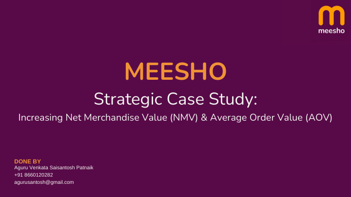
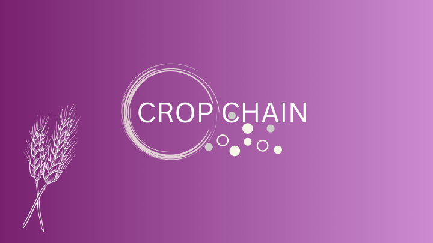
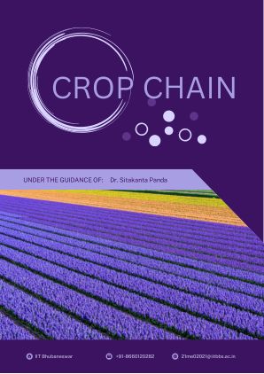
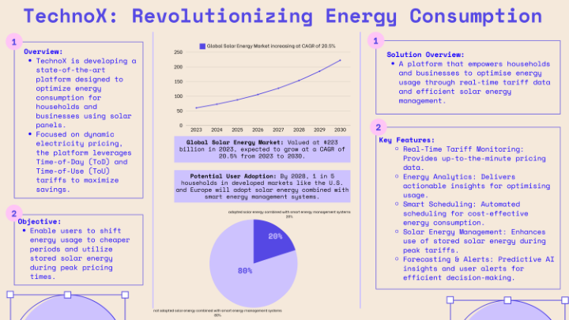
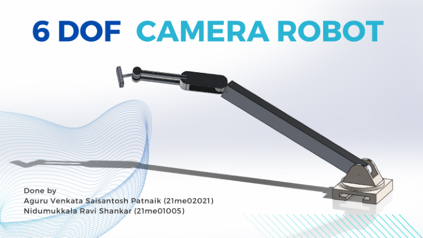
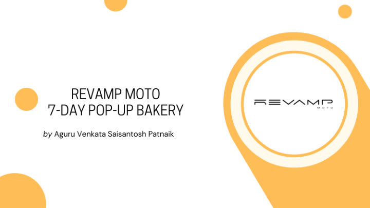

# Case Studies Portfolio

A curated collection of 7 case studies spanning AI/ML systems, mechanical engineering, startup business design, and sustainability strategy. Each document demonstrates structured problem-solving — from market sizing and technical architecture to financial modelling and competitive positioning.

---

## Table of Contents

| # | Case Study | Domain | Type |
|---|-----------|--------|------|
| 1 | [AI Food Recommendation Chatbot](#1-ai-food-recommendation-chatbot) | AI / ML Systems | Technical + Business |
| 2 | [Meesho Growth Strategy](#2-meesho-growth-strategy) | E-Commerce Analytics | Data-Driven Case Study |
| 3 | [CropChain - Agricultural Supply Chain](#3-cropchain--agricultural-supply-chain) | AgriTech / Startup | Pitch + Detailed Report |
| 4 | [ParkSe - Smart Parking App](#4-parkse--smart-parking-app) | Product / Mobility | Business Model |
| 5 | [TechnoX - Solar Energy Optimiser](#5-technox--solar-energy-optimiser) | CleanTech / AI Platform | Strategy + Market Analysis |
| 6 | [6 DOF Camera Robot](#6-6-dof-camera-robot) | Mechanical Engineering | Design + Simulation |
| 7 | [Revamp Moto Pop-Up Bakery](#7-revamp-moto-pop-up-bakery) | Entrepreneurship | Business Plan |

---

## 1. AI Food Recommendation Chatbot

**File:** `food_recommendation.pdf`

### Overview
A multi-agent RAG system that delivers personalised food recommendations through a conversational interface. The system addresses the $140.85B (2030 projected) food discovery market where generic recommendations cause 30–40% user churn.

### Technical Architecture
- **Conversational Agent** — intent extraction and dialogue management (GPT-4o-mini)
- **Retrieval Agent** — ChromaDB vector store with sharded embeddings (`sentence-transformers/all-MiniLM-L6-v2`)
- **Reranking Agent** — semantic reranking of retrieved candidates before final response
- **User Persona Clustering** — K++ Means across 4 segments (Health-conscious, Convenience, Adventurous, Budget)
- **Frontend** — Gradio interface for real-time conversation

### Key Results
- 4 distinct user persona clusters with measurable dietary preference patterns
- Sub-second retrieval across a 50K+ dish vector store (sharded ChromaDB)
- 2–5% estimated conversion lift from personalised vs. generic recommendations

---

## 2. Meesho Growth Strategy

**File:** `meesho_case_study.pdf`

### Overview
An analyst-style case study on Meesho's FY25 growth levers — specifically targeting Average Order Value (AOV) improvement and Net Merchandise Value (NMV) growth through data-driven interventions.

### Analytical Approach
- **Sentiment Analysis** — 69.3% positive / 18.2% neutral / 12.6% negative across ~10K app reviews (VADER + TextBlob)
- **LDA Topic Modelling** — identified 6 recurring complaint themes (delivery delays, quality gaps, return friction)
- **ICE Prioritisation Framework** — ranked 8 strategic actions by Impact × Confidence × Ease scores
- **Cohort Analysis** — retention segmentation across reseller and direct-consumer cohorts

### Key Recommendations
| Priority | Intervention | Expected Impact |
|----------|-------------|----------------|
| 1 | AI-powered size recommendation engine | −18% return rate |
| 2 | Hyper-local vernacular cataloguing | +12% AOV in Tier-2/3 |
| 3 | Express delivery tier for top SKUs | +9% repeat purchase rate |
| 4 | Seller quality score + auto-delist | +22% positive review share |

---

## 3. CropChain — Agricultural Supply Chain

**Files:** `Crop Chain presentation.pdf` · `CropChain Report.pdf`

### Problem Statement
India's agricultural sector generates **₹19.48 trillion** in total revenue annually, yet only **6% (≈₹1.28T)** reaches farmers due to multi-layer middlemen, post-harvest spoilage, and fragmented cold-chain infrastructure.

### Solution
CropChain redesigns the supply chain with:
- **Regional Fulfilment Centres** — aggregation hubs near farm clusters that cut intermediary stages
- **Solar Cold Storage** — off-grid refrigeration at collection points, reducing spoilage
- **Milk-Run Logistics** — consolidated routing that optimises last-mile farmer pickups
- **Direct Retail Linkage** — fulfilment centres connect directly to supermarkets and kiranas

### Competitive Landscape
| Player | Model | CropChain Advantage |
|--------|-------|---------------------|
| NinjacArt | B2B aggregator | Direct farmer integration (no middlemen) |
| eNAM | Government e-market | Physical cold chain + logistics layer |
| APMC Mandis | Traditional market | Transparent pricing + digital records |

### Financial Projections
- Break-even target: Year 3 at 12 fulfilment centres
- Farmer income uplift: from 6% → estimated 22% share of final retail price

---

## 4. ParkSe — Smart Parking App

**File:** `Park_Se.pdf`

### Problem Statement
Urban Indian cities face acute parking scarcity — drivers spend 20+ minutes searching for parking, contributing to traffic congestion and fuel waste. Existing solutions are fragmented and undigitised.

### Product Concept
ParkSe is a pre-booking parking marketplace connecting vehicle owners to registered parking space providers. Users book a spot before departure; providers earn passive income from unused space.

### Market Sizing
| Tier | Metric | Value |
|------|--------|-------|
| TAM | Registered vehicles (India) | 7 million |
| SAM | Smartphone-owning urban vehicle owners | 4 million |
| SOM | Serviceable in metro pilots (Year 1) | 700,000 |

### Business Model
- **Revenue:** ₹5 per confirmed transaction (platform fee)
- **Break-even:** 400,000 transactions/year
- **Unit Economics:** Zero marginal cost per additional booking after infrastructure is live
- **Expansion Path:** Metro pilots → Tier-1 cities → Airport/mall partnerships

---

## 5. TechnoX — Solar Energy Optimiser

**File:** `TechnoX Revolutionizing Energy Consumption.pdf`

### Market Context
- Global Solar Energy Market: **$223 billion (2023)**, growing at **CAGR 20.5%** through 2030
- By 2028: 1 in 5 households in developed markets will adopt solar + smart energy management systems

### Platform Overview
TechnoX is an AI-powered energy management platform for solar-equipped households and businesses. It leverages **Time-of-Day (ToD)** and **Time-of-Use (ToU)** electricity pricing to shift consumption to cheaper periods and maximise stored solar energy during peak tariffs.

### Key Features
| Feature | Function |
|---------|---------|
| Real-Time Tariff Monitoring | Live electricity price feed for ToD/ToU optimisation |
| Energy Analytics Dashboard | Actionable insights on usage patterns and savings |
| Smart Scheduling | Automated appliance scheduling for cost-effective consumption |
| Solar Energy Management | Optimises dispatch of stored solar during peak tariff windows |
| Forecasting & Alerts | Predictive AI alerts for tariff spikes and weather events |

### Impact
- 89% of surveyed users in target markets had not yet adopted smart solar energy management — representing the primary market opportunity

---

## 6. 6 DOF Camera Robot

**File:** `6 DOF Camera Robot.pdf`

### Overview
A 6-Degrees-of-Freedom (6 DOF) robotic camera arm designed for flexible, programmable camera positioning across all spatial orientations. The arm replicates the range of motion of a human wrist — tilt, swivel, extend, and rotate — enabling dynamic camera angles impossible with fixed mounts.

### Technical Scope
- **Mechanism Design** — 6-joint serial kinematic chain with defined workspace envelope
- **CAD Modelling** — Full 3D model with joint constraints and collision geometry
- **Applications:**
  - Film and broadcast production (automated camera motion control)
  - Surveillance systems requiring adaptive viewpoint coverage
  - Industrial inspection with remote camera placement
  - Research robotics platforms

### Key Specifications
- Degrees of Freedom: 6 (full spatial coverage)
- Camera payload: mounted at end-effector with pan/tilt capability
- Control: programmable joint trajectories for repeatable motion paths

---

## 7. Revamp Moto Pop-Up Bakery

**File:** `AGURU_BUSINESS_MODEL.pdf`

### Concept
A 7-day pop-up bakery business model built around **Revamp Moto electric cargo vehicles**. Two vehicles are deployed simultaneously — one as a live demonstration of Revamp Moto's customisable storage and display features, and one actively selling bakery products. The model showcases how electric cargo vehicles can unlock micro-entrepreneurship opportunities.

### Investment Breakdown
| Category | Cost |
|----------|------|
| Materials (ingredients, packaging, decor) | ₹3,500 |
| Permissions & location permit | ₹3,500 |
| Marketing | Free (social media + local cross-promotion) |
| Technology (orders, payments, feedback) | Free (Google Forms, UPI) |
| **Total** | **₹7,000** |

### Revenue Model
- Direct bakery product sales over 7 days
- Leverages Revamp Moto vehicle's visual appeal as organic marketing
- Mobile payments via GPay/UPI with zero transaction infrastructure cost

### Strategic Fit
Demonstrates that Revamp Moto vehicles are viable platforms for micro-business deployment — strengthening the EV brand's value proposition beyond transportation.

---

## Skills Demonstrated Across Portfolio

| Skill | Evidence |
|-------|---------|
| Data Analysis & NLP | Meesho: sentiment analysis, LDA topic modelling, ICE framework |
| AI/ML System Design | Food Recommendation: multi-agent RAG, vector databases, clustering |
| Market Sizing (TAM/SAM/SOM) | ParkSe, TechnoX, CropChain |
| Financial Modelling | ParkSe: break-even analysis; CropChain: supply chain economics |
| Technical Engineering | 6 DOF Robot: mechanism design, kinematic modelling |
| Startup Strategy | CropChain, TechnoX: competitive landscape, go-to-market |
| Business Model Design | Revamp Moto Pop-Up: unit economics, zero-budget operations |
| Sustainability Focus | CropChain (solar cold chain), TechnoX (solar energy), Revamp Moto (EV) |

---

## About

**Aguru Venkata Saisantosh Patnaik**  
B.Tech & M.Tech, IIT Bhubaneswar | AI/ML & Data Science | Product & Strategy

These case studies were produced independently and as part of academic coursework, hackathons, and internship projects. They reflect applied problem-solving across engineering, business, and technology domains.

> For project code, notebooks, and live demos - see the pinned repositories on my [GitHub profile](https://github.com/aguru-venkata-saisantosh-patnaik).
